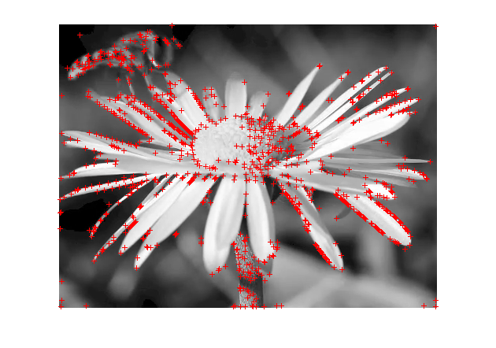
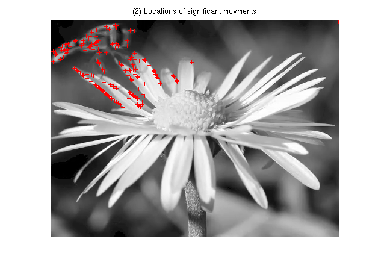
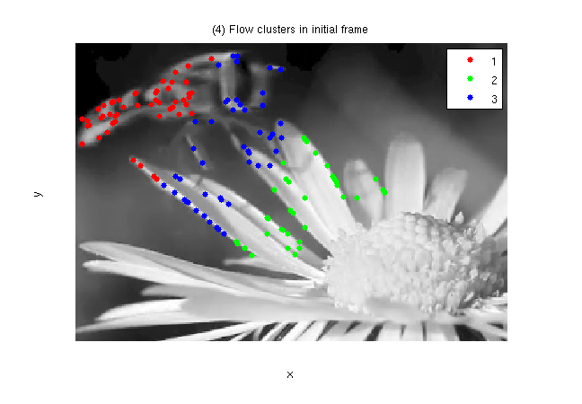
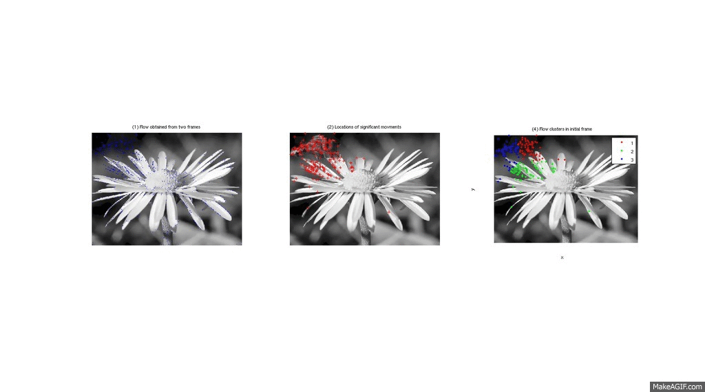

# Obstacle-Detection-Proto
Computer Vision - Moving Obstacle Detection System (SPOD System)

README: SPOD System   Version 1                13 May 2015

Shaun S. Mataire (shaun.mataire@live.com)

Jason Liu ()

## Algorithm
* Find feature points (MOPS)
* Track feature point movements (Lucas-Kanade Optical Flow)
* Find locations of significant movements
* Cluster the movements based on loctions and direction (K-Means)
* Establish cluster relavance and significance

## Key Steps
### Find feature points (MOPS)

### Optical FLow

### Locations of Significant Movements

### Obstacle Groups

## Usage
call 'SPODSystem' in MatLab

## Frame Processing
+ Image 1 - Optical Flow Detection
+ Image 2 - Locations of Optical FLow
+ Image 3 - Groups of Related Flows(Obstacles/Objects)

## Console Output: 
This output is the for the relavence of obstacle.
The first column is the The Frame Number, the second if the Cluster
Number and the Third is the Mean Cluster Optical Flow Magnitude

### Sample Output
1.0000    1.0000    8.4468

1.0000    2.0000    9.3308

...

